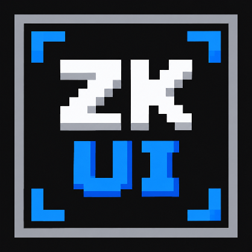
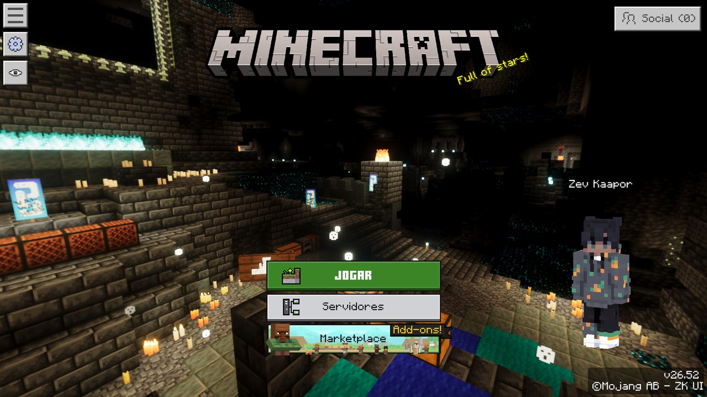
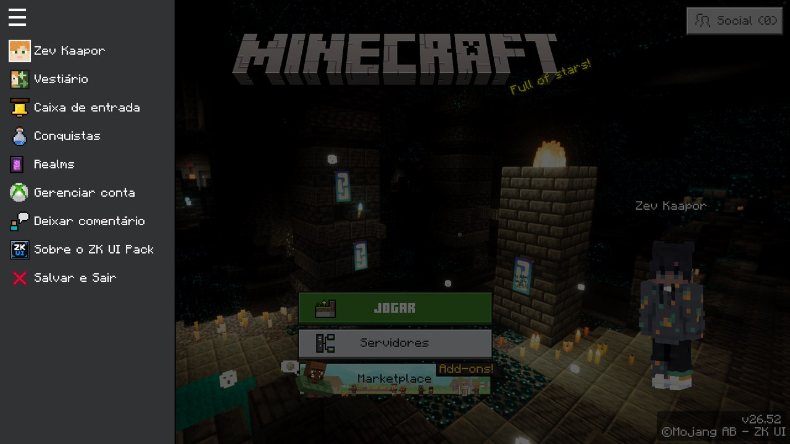
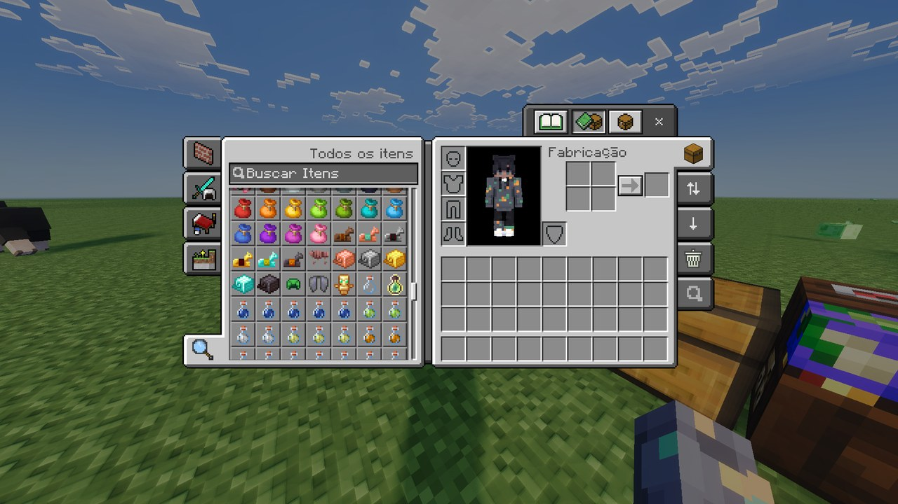
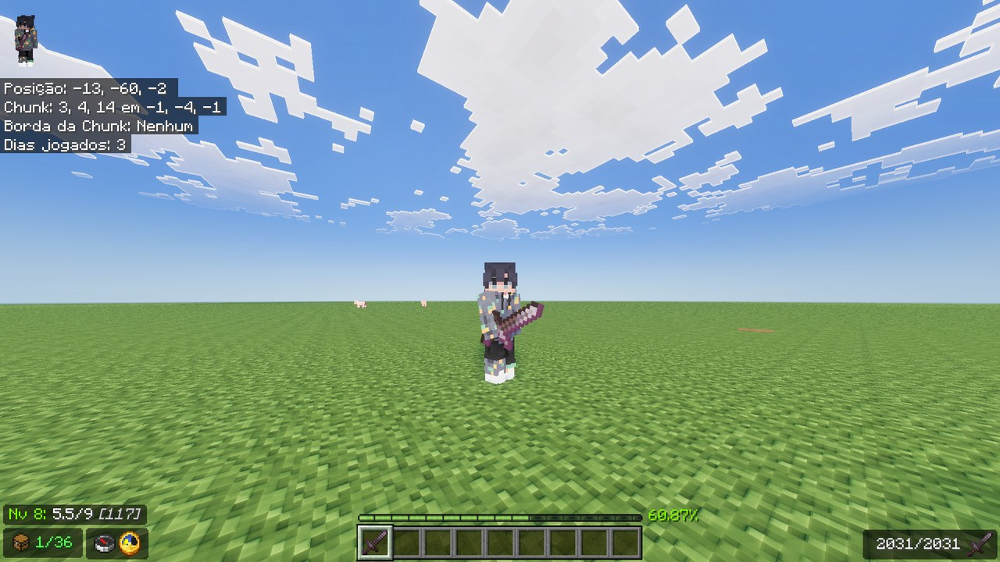
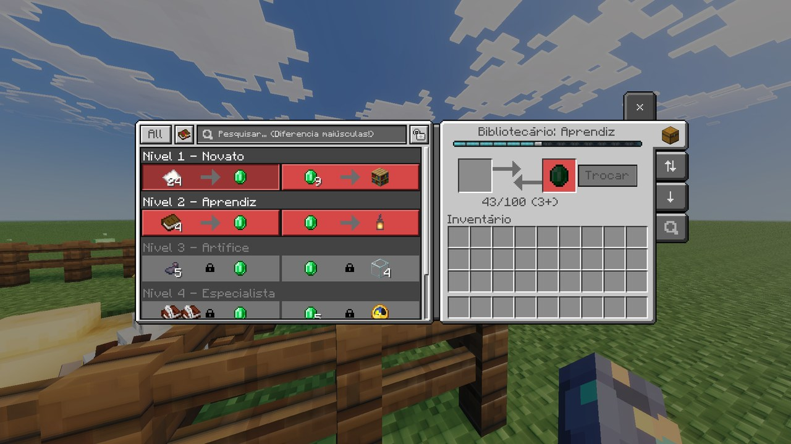
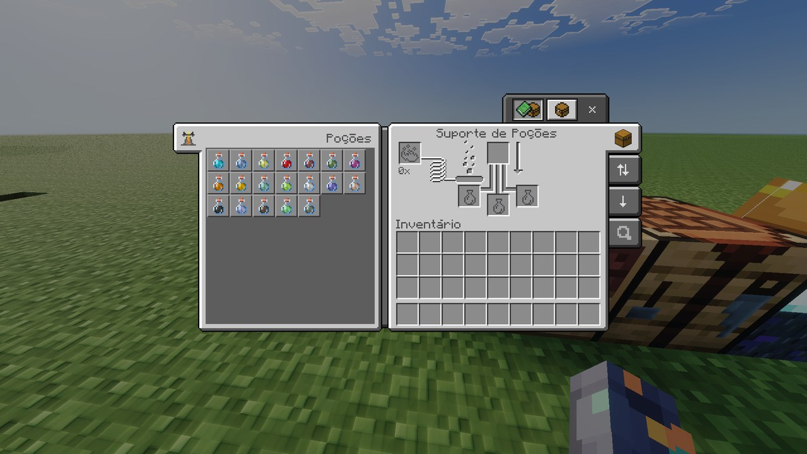
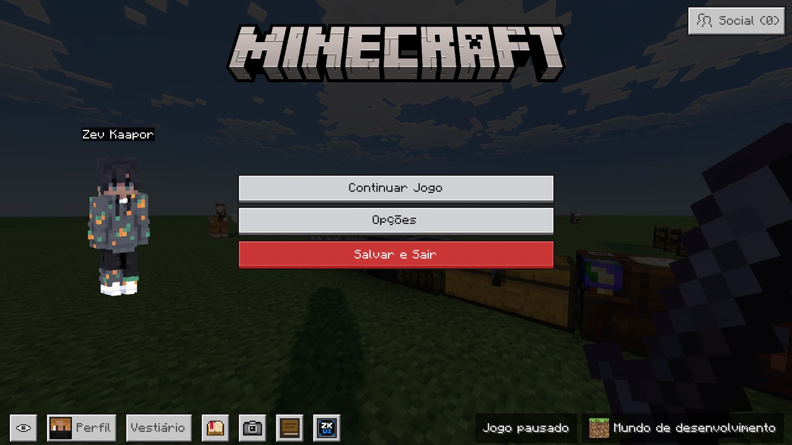
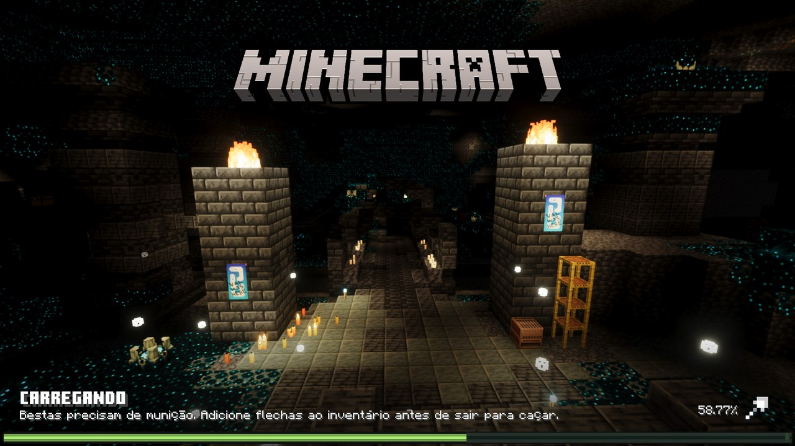

# ZK UI Pack

### Clean vanilla-style interface pack for Minecraft Bedrock

 

 

<b>📋 Table of Contents</b>

- [🧭 Overview](#overview)
- [🖼️ Screenshots](#screenshots)
- [⚙️ Features](#features)
- [📥 Download Now](#download-now)
- [🧩 Installation](#installation)
- [❓ FAQ](#faq)
- [🌍 Languages](#languages)
- [✨ Special Thanks](#special-thanks)
- [📜 Terms of Use](#terms-of-use)
- [⚖️ Disclaimer](#disclaimer)

 

> [!NOTE]
> **Resource pack only** - ZK UI Pack is an interface texture pack. It is not a modified client and it does not change how the game plays.

> **Current Status** - The pack is in active development 🚀. New screens and tools arrive with every version.

 

---

<!-- OVERVIEW - Visão Geral do Projeto -->

<h1>Overview</h1>

<em>ZK UI Pack keeps the vanilla look of Minecraft Bedrock and adds the tools the base interface is missing.</em>

<em>Item modes, item search, guides, a richer HUD, custom sounds and many quality of life tweaks, all in a regular resource pack with no client modification required.</em>

 

---

<!-- SCREENSHOTS - Capturas de Tela -->

<h1>Screenshots</h1>

<table>
  <tr>
    <td align="center"> <b>Start screen</b></td>
    <td align="center"> <b>Side menu</b></td>
  </tr>
  <tr>
    <td align="center"> <b>Inventory</b></td>
    <td align="center"> <b>HUD</b></td>
  </tr>
  <tr>
    <td align="center"> <b>Trading</b></td>
    <td align="center"> <b>Brewing stand</b></td>
  </tr>
  <tr>
    <td align="center"> <b>Pause screen</b></td>
    <td align="center"> <b>Loading screen</b></td>
  </tr>
</table>

 

---

<!-- FEATURES - Funcionalidades -->

<h1>Features</h1>

<h3>🏠 Menus and Screens</h3>

| Feature | Description |
| :--- | :--- |
| **Start Screen** | Centered layout with quick access to Play, Servers and Marketplace. |
| **Side Menu** | Shortcuts to profile, dressing room, inbox, achievements and Realms. |
| **Settings** | Screens in the Ore UI visual style, with option search and storage management. |
| **Pause and Loading** | Shortcuts, quit confirmation, loading percentage and a notice for stuck loading. |
| **Hide Interface** | Option to hide the interface and view the panorama or the world. |

 

<h3>🎒 Inventory and Containers</h3>

| Feature | Description |
| :--- | :--- |
| **Item Modes** | Normal, Quick Move, Drop and Destroy (Creative only), with an x64 or x1 amount. |
| **Item Search** | A search tab that highlights the matching items, with an invert option. |
| **Move All** | Buttons to move everything between your inventory and a container in one click. |
| **Everywhere** | Available in chests, barrels, shulker boxes, hoppers and every workstation. |

 

<h3>🛠️ Workstations</h3>

| Feature | Description |
| :--- | :--- |
| **Furnaces** | Fuel guide with burning times, plus cooking and fuel percentages. |
| **Brewing Stand** | Guide of every potion recipe, brewing time and fuel left. |
| **Trading** | Item search, enchanted offers filter, instant trade and level progress. |
| **Anvil and Grindstone** | Durability gained shown before you confirm. |
| **Smithing Table** | Armor preview with rotation sliders. |

 

<h3>🧭 In Game</h3>

| Feature | Description |
| :--- | :--- |
| **HUD** | Exact experience, free slots counter, compass and clock, and held item totals. |
| **Chat** | Message search, caret mode and a settings screen. |
| **Player List** | Player list menu with a scoreboard sidebar toggle. |
| **Sounds** | Custom click sound on buttons and toggles. |

 

<em>🚀 And more, with new features being added in every version.</em>

 

---

<!-- DOWNLOAD - Downloads -->

<h1>Download Now</h1>

&nbsp;&nbsp;

<em>Every release ships a ready to use <b>.mcpack</b> file and its changelog.</em>

 

---

<!-- INSTALLATION - Instalação -->

<h1>Installation</h1>

| Step | What to do |
| :---: | :--- |
| **1** | Download the latest `.mcpack` file from the [releases page](https://github.com/Zev-Kaapor/ZK_UI_Pack/releases/latest). |
| **2** | Open the file. Minecraft starts and imports the pack by itself. |
| **3** | Go to **Settings > Global Resources** and activate **ZK UI Pack** under *My Packs*. |
| **4** | Keep it at the **top** of the active packs, so other packs do not override its screens. |

 

> [!TIP]
> **Updating?** Remove the old version from *Global Resources* and from *Storage* before importing the new one, so the game does not keep outdated files.

 

---

<!-- FAQ - Perguntas Frequentes -->

<h1>FAQ</h1>

  
<b>Is ZK UI Pack free to use?</b>

   
  Yes, it is completely free. There are no paid versions or hidden costs.
    

  
<b>Is this a modified client or a hack?</b>

   
  No. It is only a resource pack that redraws the interface with the tools the game already offers. It does not change the game files or how the game plays.
    

  
<b>Which version of Minecraft do I need?</b>

   
  The pack is built on the most recent version of Minecraft Bedrock. Older versions may show broken or missing screens, because the interface files change between updates.
    

  
<b>Does it work on phones and consoles?</b>

   
  The pack is made for the desktop interface. The pocket (touch) screens are left as the game ships them, so most of the extra tools do not appear there.
    

  
<b>Why do some screens still look like the default game?</b>

   
  Some screens of Minecraft Bedrock are made with Ore UI and cannot be changed by a resource pack. Those stay exactly as Mojang made them.
    

  
<b>Does it work with other resource packs?</b>

   
  Yes, as long as they do not change the same interface files. Keep ZK UI Pack above them in the active packs list.
    

  
<b>Something looks broken after a game update. What do I do?</b>

   
  Game updates often change the interface files. Check if there is a newer release of the pack, and if the problem remains, open an issue with a screenshot.
    

 

<h3>More questions? <a href="https://github.com/Zev-Kaapor/ZK_UI_Pack/issues">Open an issue on GitHub!</a></h3>

 

---

<!-- LANGUAGES - Idiomas -->

<h1>Languages</h1>

<em>The pack texts are available in two languages 🌍</em>

| Language | Status |
| :--- | :---: |
| **English (US)** | ✅ Complete |
| **Português (Brasil)** | ✅ Complete |

 

---

<!-- ACKNOWLEDGMENTS - Agradecimentos -->

<h1>Special Thanks</h1>

<em>ZK UI Pack stands on the shoulders of incredible community work!</em>

 

| Project | Author | Contribution |
| :--- | :--- | :--- |
| **Ty-el UI** | @tlgm2308 | Side menu, dialogs, About screen, item modes, HUD and chat |
| **Déesse UI** | @Itzriyo157 | Settings screens, brewing guide, trading tools, item search and fuel guide |
| **Minecraft** | Microsoft and Mojang Studios | Original interface and sounds |

 

<em>Their code and assets were adapted with the permission of the authors.</em>

 

---

<!-- TERMS OF USE - Termos de Uso -->

<h1>Terms of Use</h1>

| | Rule |
| :---: | :--- |
| ✅ | You may modify and adapt this pack for personal use. |
| ✅ | When sharing changes, keep the credits of ZK UI Pack and the original authors. |
| ❌ | Do not redistribute this pack or modified versions on stores or monetization platforms without permission. |
| ❌ | Do not present the code or assets as your own creation. |

 

---

<!-- DISCLAIMER - Aviso Legal -->

<h1>Disclaimer</h1>

ZK UI Pack is a non-commercial project developed for personal use. This project is **not affiliated with, funded, authorized, endorsed by, or associated** with Microsoft, Mojang Studios, or any of their affiliates and subsidiaries.

 

Minecraft and all related trademarks and assets belong to their respective owners.

 

---

 

**Made with 💙 by [Zev Kaapor](https://github.com/Zev-Kaapor)**

